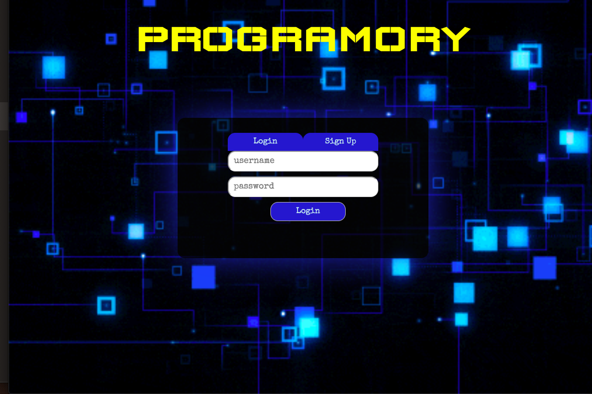
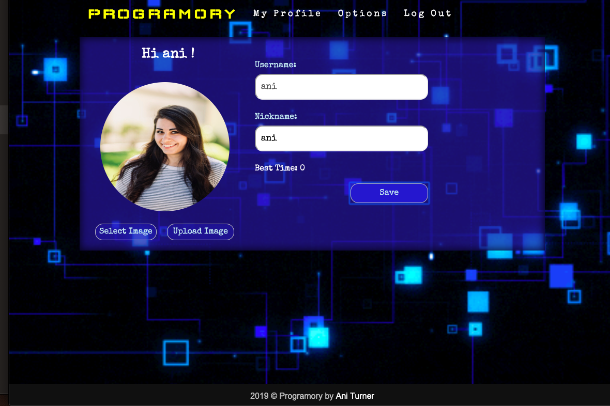
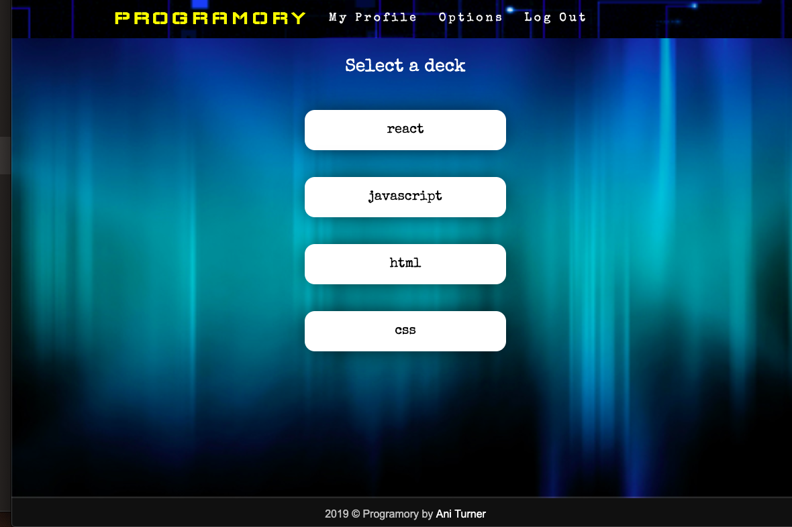
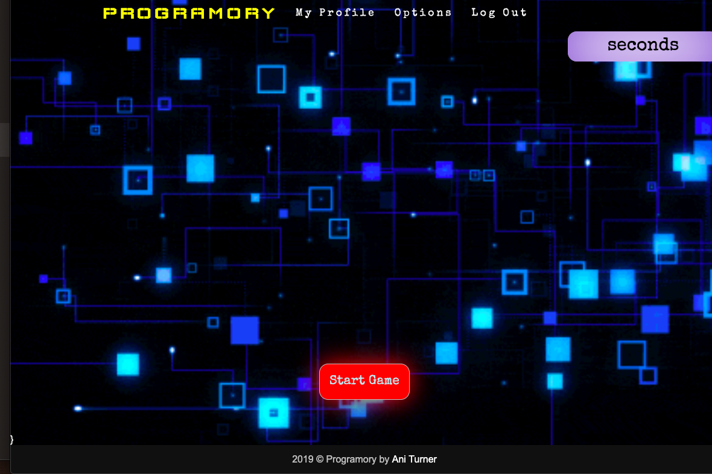
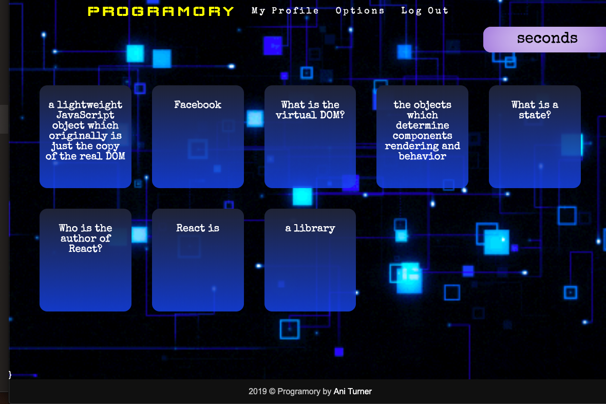

# PROGRAMORY 
### > For V School // Full Stack JavaScript // January 2019 Cohort
#### Demo:
- <a href="https://programory-app.herokuapp.com" target="_blank">PROGRAMORY</a>
#### Completed according to assignment instructions: 
- https://coursework.vschool.io/first-full-stack-application/
#### Technologies Used
* HTML, CSS, JavaScript, React, Context, Axios, Node.js, Express, MongoDB, Authentication
#### Screenshot:

